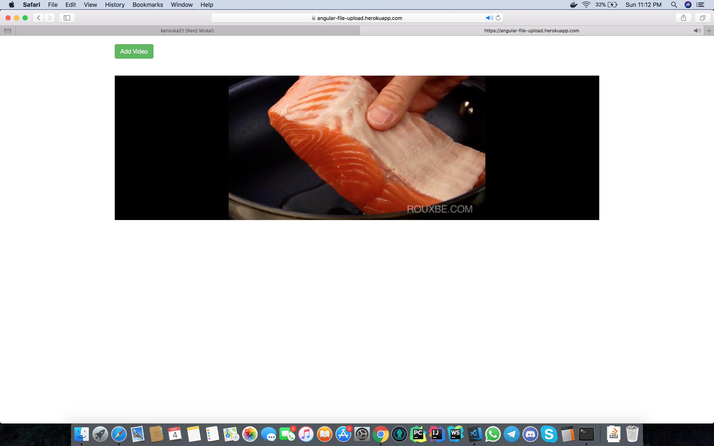

# angular-file-upload
Angular example of file upload using Wistia and Blueimp.



#### Install Dependencies
```sh
$ npm install
```

#### Run the Application
```sh
$ npm start
```
Now the application is running in http://localhost:3000/.


#### Run Tests
```sh
$ npm test
```
